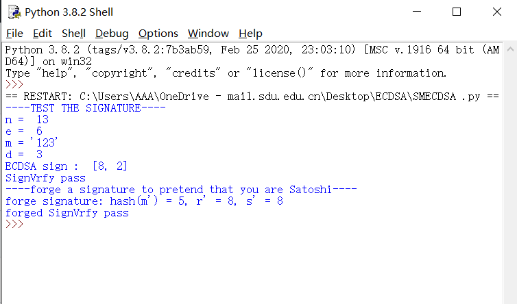

# ECDSA

项目作者：董大铨

**库依赖：**

1. numpy
2. Crypto
3. hashlib

该项目实现ECDSA签名和验证，并实现了签名的伪造。其中签名的伪造只能得到某个特定hash值的签名，但是无法直接得到消息的签名值，随机选择$u,v$，计算$R'=(x',y')=uG+vP, r' = x' \pmod{n}$，为了通过验证，需要$s'^{-1}(e'G+r'P) = uG + vP$，令$e'=r'uv^{-1}\pmod{n},s'=r'v^{-1}\pmod{n}$，那么得到的$(r',s')$即为哈希值$e'$用未知的私钥$d$签的签名。

**签名过程如下：**
-
1、选择一条椭圆曲线Ep(a,b)，和基点G；

2、选择私有密钥k（k<n，n为G的阶），利用基点G计算公开密钥K=kG；

3、产生一个随机整数r（r<n），计算点R=rG；

4、将原数据和点R的坐标值x,y作为参数，计算SHA1做为hash，即Hash=SHA1(原数据,x,y)；

5、计算s≡r - Hash * k (mod n)

6、r和s做为签名值，如果r和s其中一个为0，重新从第3步开始执行。

**验证过程如下：**
-
1、接受方在收到消息(m)和签名值(r,s)后，进行以下运算

2、计算：sG+H(m)P=(x1,y1), r1≡ x1 mod p。

3、验证等式：r1 ≡ r mod p。

4、如果等式成立，接受签名，否则签名无效。

运行结果如下：

签名验证并伪造成功：

**参考链接**

【1】https://zhuanlan.zhihu.com/p/442141489

【2】https://blog.csdn.net/weixin_39430411/article/details/118685484

