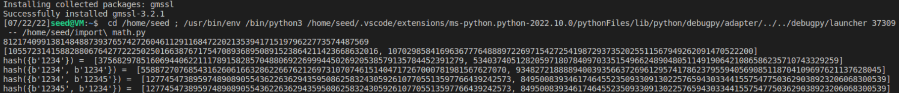

# SM2-ECMH

**作者：**邵鹏翔，董大铨

**库依赖：**

1. gmssl
2. random
3. crypto

**代码实现思路**

将集合内的元素进行椭圆曲线上点的映射，通过椭圆曲线上加法的实现来进行哈希值求解。以下为重要步骤说明

定义点加法和乘法：

```python
def SM2_Mulyipoint(k, P, a, p):  # 返回值R = k*P , P为椭圆曲线上的一点 , k为正整数
    k_b = bin(k).replace('0b', '')  # 按2^i分层逐层运算
    i = len(k_b) - 1
    R = P
    if i > 0:
        k = k - 2 ** i
        while i > 0:
            R = SM2_Pluspoint(R, R, a, p)
            i -= 1
        if k > 0:
            R = SM2_Pluspoint(R, SM2_Mulyipoint(k, P, a, p), a, p)
    return R


def SM2_Pluspoint(P, Q, a, p):  # 返回值R = P+Q , P、Q为椭圆曲线上的两点 , 加法运算为定义在椭圆曲线上的加法
    if (math.isinf(P[0]) or math.isinf(P[1])) and (~math.isinf(Q[0]) and ~math.isinf(Q[1])):  # OP = P
        R = Q
    elif (~math.isinf(P[0]) and ~math.isinf(P[1])) and (math.isinf(Q[0]) or math.isinf(Q[1])):  # PO = P
        R = P
    elif (math.isinf(P[0]) or math.isinf(P[1])) and (math.isinf(Q[0]) or math.isinf(Q[1])):  # OO = O
        R = [float('inf'), float('inf')]
    else:
        if P != Q:
            l = SM2__Mod_Decimal(Q[1] - P[1], Q[0] - P[0], p)
        else:
            l = SM2__Mod_Decimal(3 * P[0] ** 2 + a, 2 * P[1], p)
        x = SM2_Mod(l ** 2 - P[0] - Q[0], p)
        y = SM2_Mod(l * (P[0] - x) - P[1], p)
        R = [x, y]
    return R

```

Tonelli_Shanks求二次剩余

```
def Tonelli_Shanks(n, p):  
    assert Legendre(n, p) == 1
    if p % 4 == 3:
        return pow(n, (p + 1) // 4, p)
    q = p - 1
    s = 0
    while q % 2 == 0:
        q = q // 2
        s += 1
    for z in range(2, p):
        if Legendre(z, p) == p - 1:
            c = pow(z, q, p)
            break
    r = pow(n, (q + 1) // 2, p)
    t = pow(n, q, p)
    m = s
    if t % p == 1:
        return r
    else:
        i = 0
        while t % p != 1:
            temp = pow(t, 2 ** (i + 1), p)
            i += 1
            if temp % p == 1:
                b = pow(c, 2 ** (m - i - 1), p)
                r = r * b % p
                c = b * b % p
                t = t * c % p
                m = i
                i = 0
        return r
```

## 结果展示：

