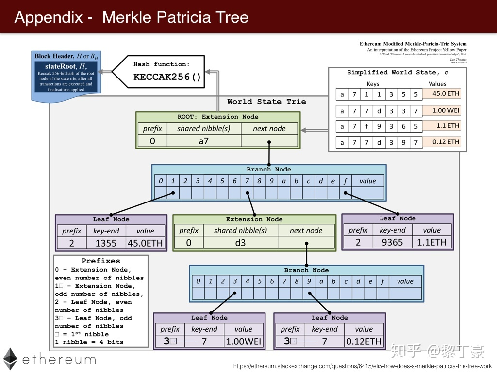

## 项目说明 -- MPT研究报告

报告人：董大铨

## 默克尔树（Merkle tree）

Merkle Tree，通常也被称作[Hash](https://so.csdn.net/so/search?q=Hash&spm=1001.2101.3001.7020) Tree，顾名思义，就是存储hash值的一棵树。Merkle树的叶子是数据块(例如，文件或者文件的集合)的hash值。非叶节点是其对应子节点串联字符串的hash。

**和哈希表对比**

Merkle Tree可以看做Hash List的泛化（Hash List可以看作一种特殊的Merkle Tree，即树高为2的多叉Merkle Tree）。

在最底层，和哈希列表一样，我们把数据分成小的数据块，有相应地哈希和它对应。但是往上走，并不是直接去运算根哈希，而是把相邻的两个哈希合并成一个字符串，然后运算这个字符串的哈希，这样每两个哈希就结婚生子，得到了一个”子哈希“。

Merkle Tree和Hash List的主要区别是，可以直接下载并立即验证Merkle Tree的一个分支。因为可以将文件切分成小的数据块，这样如果有一块数据损坏，仅仅重新下载这个数据块就行了。如果文件非常大，那么Merkle tree和Hash list都很到，但是Merkle tree可以一次下载一个分支，然后立即验证这个分支，如果分支验证通过，就可以下载数据了。而Hash list只有下载整个hash list才能验证。

**特点**

1. MT是一种树，大多数是二叉树，也可以多叉树，无论是几叉树，它都具有树结构的所有特点；
2. Merkle Tree的叶子节点的value是数据集合的单元数据或者单元数据HASH。
3. 非叶子节点的value是根据它下面所有的叶子节点值，然后按照Hash算法计算而得出的。

**操作**

1. 创建

   

2. 检索

   

3. 更新插入和删除

   

**典型场景**

1. 数字签名

2. p2p网络分块下载文件的时候，快速校验下载到的数据是否完整，是否遭到破坏。

3. 可信计算

   

## Patricia Tree 帕特里克树

是一种更节省空间的Trie。对于基数树的每个节点，如果该节点是唯一的儿子的话，就和父节点合并。


## Merkle Patricia Tree

MPT是默克尔树和帕特里夏树的结合缩写，是一种经过改良的、融合了默克尔树和前缀树两种树结构优点的数据结构，以太坊使用mpt存储所有账户状态，以及每个区块中的交易和收据数据。是一种典型的用空间换时间的数据结构。

**主要功能**

- 存储任意长度的key-value键值对数据
- 快速计算所维护数据集哈希标识
- 快速状态回滚
- 默克尔证明的证明方法，进行轻节点的扩展，实现简单支付验证

**组成**

- 叶子节点和分支节点可以保存value, 扩展节点保存key；
- 没有公共的key就成为2个叶子节点；key1=[1,2,3] key2=[2,2,3]
- 有公共的key需要提取为一个扩展节点；key1=[1,2,3] key2=[1,3,3] => ex-node=[1],下一级分支node的key
- 如果公共的key也是一个完整的key，数据保存到下一级的分支节点中；key1=[1,2] key2=[1,2,3] =>ex-node=[1,2],下一级分支node的key; 下一级分支=[3],上一级key对应的value



可以看到有四个状态要存储在世界状态的MPT树中，需要存入的值是键值对的形式。

- 首先看到的根哈希，由**keccak256**生成的，参考默克尔树的Top Hash，
- 绿色的扩展节点Extension Node，其中共同前缀shared nibble是a7，采用了压缩前缀树的方式进行了合并，
- 蓝色的分支节点Branch Node，其中有表示十六进制的字符和一个value，最后的value是fullnode的数据部分，
- 紫色的叶子节点leadfNode，用来存储具体的数据，它也是对路径进行了压缩。


**存数据方式：**

若存以下数据：

```text
key  	 |  values
----------------------
a711355  |  45.0 ETH
a77d337  |  1.00 WEI
a7f9365  |  1.1  ETH
a77d397  |  0.12 ETH
```

插入第一个<a711355, 45>，由于只有一个key,直接用leaf node既可表示


接着插入a77d337,由于和a711355共享前缀’a7’,因而可以创建’a7’扩展节点。


接着插入a7f9365,也是共享’a7’,只需新增一个leaf node.


最后插入a77d397,这个key和a77d337共享’a7’+’d3’,因而再需要创建一个’d3’扩展节点


将叶子节点和最后的short node合并到一个节点了，事实上源码实现需要再深一层，最后一层的叶子节点只有数据


```text
// nodeFlag contains caching-related metadata about a node.
type nodeFlag struct {
    hash  hashNode // cached hash of the node (may be nil)
    gen   uint16   // cache generation counter
    dirty bool     // whether the node has changes that must be written to the database
}
```

### 以太坊中对MPT的key编码

- Raw编码（原生字符）
- Hex编码（扩展16进制编码）
- Hex-Prefix编码（16进制前缀编码）


### 
