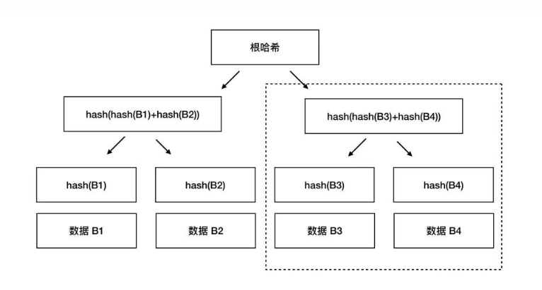
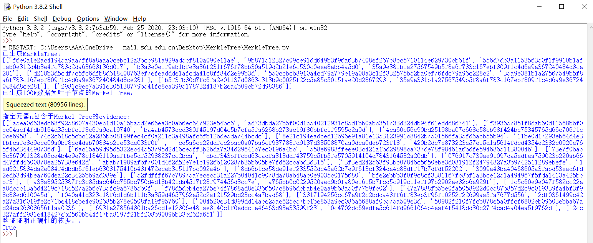

# MerkleTree
作者：董大铨

依据协议RFC6962实现Merkel树，构造具有10w叶节点的Merkle树，可以对指定元素构建包含关系的证明，可以对指定元素构建不包含关系的证明

**Merkle Tree**

Merkle Tree 本身也算是一个哈希列表，只不过是在这个基础上又引入了树形结构，从而获得了更高的灵活性。在最底层，和哈希列表一样，我们把数据分成小的数据块，有相应的哈希和它对应。但是往上走，并不是直接去运算根哈希，而是把相邻的两个哈希合并成一个字符串，然后运算这个字符串的哈希，这样每两个哈希就结婚生子，得到了一个”子哈希“。如果最底层的哈希总数是单数，那到最后必然出现一个单身哈希，这种情况就直接对它进行哈希运算，所以也能得到它的子哈希。于是往上推，依然是一样的方式，可以得到数目更少的新一级哈希，最终必然形成一棵倒挂的树，到了树根的这个位置，这一代就剩下一个根哈希了，我们把它叫做 Merkle Root 。

Merkle树的叶子是数据块(例如，文件或者文件的集合)的hash值。非叶节点是其对应子节点串联字符串的hash。

Merkle Tree和Hash List的主要区别是，可以直接下载并立即验证Merkle Tree的一个分支。因为可以将文件切分成小的数据块，这样如果有一块数据损坏，仅仅重新下载这个数据块就行了。如果文件非常大，那么Merkle tree和Hash list都很到，但是Merkle tree可以一次下载一个分支，然后立即验证这个分支，如果分支验证通过，就可以下载数据了。而Hash list只有下载整个hash list才能验证。 

**代码实现思路**

首先初始化一个二维列表用于存放Merkel tree，计算树的深度和叶子节点的个数，接着计算数据哈希值并写入叶子节点；每两个子节点计算相加后的哈希值并写入父节点列表。 而对于同一层的节点可以重复调用这个function（过程），生成下一层（父节点层）Merkle树的节点；每层向上生成父节点的时候，需要讨论对于节点数为奇数的层的最后一个节点，直接写入下一层（父节点层）；节点数为偶数则正好配对完全，进行递归步骤(3)和(4)的过程，循环步骤(1)计算的树的深度，完成Merkle树的生成过程；进行实验测试：输入测试数据，调用Tree_Generate()函数将整个Merkle树printf出来，相同深度的node位于同一个列表中。

**任务完成情况**

以下为代码运行情况，可以看到已完成四个任务：

****

**参考资料**

【1】http://www.jianshu.com/p/458e5890662f

【2】http://blog.csdn.net/yuanrxdu/article/details/22474697?utm_source=tuicool&utm_medium=referral

【3】https://blog.csdn.net/wxudong1991/article/details/109311928

