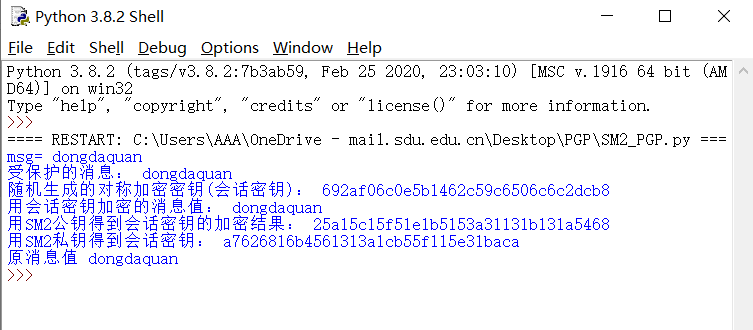

## SM2实现简单PGP方案

**作者：董大铨，邵鹏翔**

**库依赖：**

1. random
2. Crypto
3. gmssl

**PGP简介**

PGP-Pretty Good Privacy，是个混合加密算法，它由一个对称加密算法、一个非对称加密算法、与单向散列算法以及一个随机数产生器（从用户击键频率产生伪随机数序列的种子）组成的，每种算法都是PGP不可分割的组成部分。

**实现方案**

本实验中我们直接调用了gmssl中的sm2/sm4加解密函数。在加密时使用对称加密算法AES加密消息，非对称加密算法SM2加密会话密钥；解密时先使用SM2解密求得会话密钥，再通过AES和会话密钥求解原消息。

**代码实现**

以下部分实现PGP加密：

```python
def PGP_Encrypt(mes, k):
    mode = AES.MODE_OFB
    iv = '7380166f4914b2b9172442d7da8a0600a96f30bc163138aae38dee4db0fb0e4e'
    cryptor = AES.new(k.encode('utf-8'), mode, iv)
    length = 16
    count = len(mes)
    if count % length != 0:
        add = length - (count % length)
    else:
        add = 0
    mes = mes + ('\0' * add)
    ciphertext1 = cryptor.encrypt(mes.encode('utf-8'))
    plaintext_bytes = k.encode('utf-8')
    ciphertext2 = SM2_enc(plaintext_bytes)
    print("用会话密钥加密的消息值：", ciphertext1)
    print("用SM2公钥得到会话密钥的加密结果：", ciphertext2)
    return ciphertext1, ciphertext2
```

接下来实现PGP解密：

```python
mode = AES.MODE_OFB
    iv = b'0000000000000000'
    get_key = SM2_dec(mes2)
    print("用SM2私钥得到会话密钥：", get_key.decode('utf-8'))
    cryptor = AES.new(get_key, mode, iv)
    plain_text = cryptor.decrypt(mes1)
```

实现交换密钥：

```python
[sk, pk] = ECMH_project.key_gen(a, p, n, G)
    sk_bytes = hex(sk)[2:]
    pk_bytes = hex(pk[0])[2:] + hex(pk[1])[2:]
    sm2_crypt = sm2.CryptSM2(public_key=pk_bytes, private_key=sk_bytes)
```

### 运行结果：

