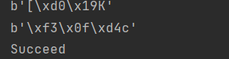

# SM3 Birthday Attack

所用算法库：[snowland-smx · PyPI](https://pypi.org/project/snowland-smx/)

当我们要找到n bits的碰撞时

首先生成两个长为sqrt(n)，每个元素是为nbits长字符串。接下来计算两个序列的哈希值，作为两个新序列。最后再求序列的交集

运行结果如下：

董大铨(DaquanDong) 201900460054
