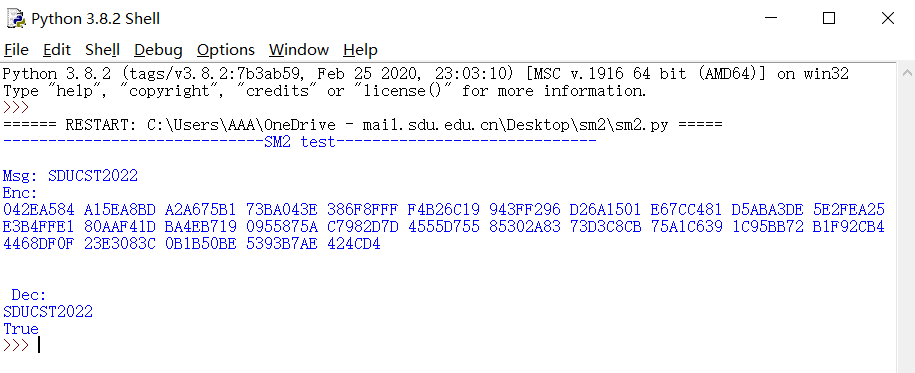

## impl SM2 with RFC6979

**完成者：董大铨，邵鹏翔**（按贡献排序）

**库依赖**

1. math
2. random

## SM2

SM2是国家密码管理局于2010年12月17日发布的[椭圆曲线](https://so.csdn.net/so/search?q=椭圆曲线&spm=1001.2101.3001.7020)公钥密码算法。
SM2算法和[RSA](https://so.csdn.net/so/search?q=RSA&spm=1001.2101.3001.7020)算法都是公钥密码算法，SM2算法是一种更先进安全的算法，在我们国家商用密码体系中被用来替换RSA算法。

**算法流程**

[国家密码管理局-SM2椭圆曲线公钥密码算法](https://sca.gov.cn/sca/xwdt/2010-12/17/1002386/files/b791a9f908bb4803875ab6aeeb7b4e03.pdf)

**基础参数**

SM2的曲线方程为 $y^2 = x^3 + ax + b $ ，其中：

a：0xFFFFFFFEFFFFFFFFFFFFFFFFFFFFFFFFFFFFFFFF00000000FFFFFFFFFFFFFFFC
b：0x28E9FA9E9D9F5E344D5A9E4BCF6509A7F39789F515AB8F92DDBCBD414D940E93
p：0xFFFFFFFEFFFFFFFFFFFFFFFFFFFFFFFFFFFFFFFF00000000FFFFFFFFFFFFFFFF
私钥长度：32字节。

公钥长度：SM2非压缩公钥格式字节串长度为65字节，压缩格式长度为33字节，若公钥y坐标最后一位为0，则首字节为0x02，否则为0x03。非压缩格式公钥首字节为0x04。

签名长度：64字节。

**密钥对生成**

1. 用随机数发生器产生整数 $ d\in[1,n-2]$；
2. G 为基点，计算点 $ P=(x_P,y_P)=[d]G$ 。
   则私钥是$d$，公钥为$P$。

**加密过程：**
    设需要发送的消息为比特串 M ，klen 为 M 的比特长度。
    为了对明文 M 进行加密，作为加密者的用户 A 应实现以下运算步骤：
    A1：用随机数发生器产生随机数k∈[1,n-1]；
    A2：计算椭圆曲线点 C1=[k]G=(x1,y1)，（[k]G 表示 k$*$G ）将C1的数据类型转换为比特串；
    A3：计算椭圆曲线点 S=[h]PB，若S是无穷远点，则报错并退出；
    A4：计算椭圆曲线点 [k]PB=(x2,y2)，将坐标 x2、y2 的数据类型转换为比特串；
    A5：计算t=KDF(x2 ∥ y2, klen)，若 t 为全0比特串，则返回 A1；
    A6：计算C2 = M ⊕ t；
    A7：计算C3 = Hash(x2 ∥ M ∥ y2)；
    A8：输出密文C = C1 ∥ C2 ∥ C3。
**解密过程：**
    设klen为密文中C2的比特长度。
    为了对密文C=C1 ∥ C2 ∥ C3 进行解密，作为解密者的用户 B 应实现以下运算步骤：
    B1：从C中取出比特串C1，将C1的数据类型转换为椭圆曲线上的点，验证C1是否满足椭圆曲线方程，若不满足则报错并退出；
    B2：计算椭圆曲线点 S=[h]C1，若S是无穷远点，则报错并退出；
    B3：计算[dB]C1=(x2,y2)，将坐标x2、y2的数据类型转换为比特串；
    B4：计算t=KDF(x2 ∥ y2, klen)，若t为全0比特串，则报错并退出；
    B5：从C中取出比特串C2，计算M′ = C2 ⊕ t；
    B6：计算u = Hash(x2 ∥ M′ ∥ y2)，从C中取出比特串C3，若u != C3，则报错并退出；
    B7：输出明文M′。
**原理：**
     用户 A 持有公钥PB=[dB]G（仅有PB值），用户 B 持有私钥 dB
     加密：C1=k$*$G  C2=M⊕(k$*$PB)      解密：M′=C2 ⊕ (dB$*$C1)    
     证明：dB*C1=dB*k$*$G=k$*$(dB$*$G)=k$*$PB  因此，M′=C2 ⊕ (dB$*$C1)=M⊕(k$*$PB)⊕(k*PB)=M  得证


## 代码说明及运行

定义加法和乘法

```python
#求加法
def ADD(x1,y1,x2,y2,a,p):
    if x1==x2 and y1==p-y2:
        return False
    if x1!=x2:
        lamda=((y2-y1)*pow(x2-x1,-1, p))%p
    else:
        lamda=(((3*x1*x1+a)%p)*pow(2*y1,-1, p))%p
    x3=(lamda*lamda-x1-x2)%p    # lamda 表达式
    y3=(lamda*(x1-x3)-y1)%p
    return x3,y3

#调用加法求乘法
def Multiply(x,y,k,a,p):
    k=bin(k)[2:]
    qx,qy=x,y
    for i in range(1,len(k)):
        qx,qy=ADD(qx, qy, qx, qy, a, p)
        if k[i]=='1':
            qx,qy=ADD(qx, qy, x, y, a, p)
    return qx,qy

```

写密钥函数

```python
def KDF(z,klen):
    ct=1
    k=''
    for _ in range(math.ceil(klen/256)):
        k=k+sm3hash(hex(int(z+'{:032b}'.format(ct),2))[2:])
        ct=ct+1
    k='0'*((256-(len(bin(int(k,16))[2:])%256))%256)+bin(int(k,16))[2:]
    return k[:klen]
```

按照要求写出加解密函数后进行测试，选取的是字符串'SDUCST2022',结果如下：



参考文献：

【1】[国密SM2算法_zcc0721的博客-CSDN博客_sm2签名长度](https://blog.csdn.net/u013137970/article/details/84573200)

【2】[Python：SM2_千干的博客-CSDN博客_python sm2](https://blog.csdn.net/qq_33439662/article/details/122590298?ops_request_misc=%7B%22request%5Fid%22%3A%22165909424616782246444181%22%2C%22scm%22%3A%2220140713.130102334..%22%7D&request_id=165909424616782246444181&biz_id=0&utm_medium=distribute.pc_search_result.none-task-blog-2~all~top_positive~default-2-122590298-null-null.142^v35^pc_search_v2&utm_term=sm2 python&spm=1018.2226.3001.4187)
